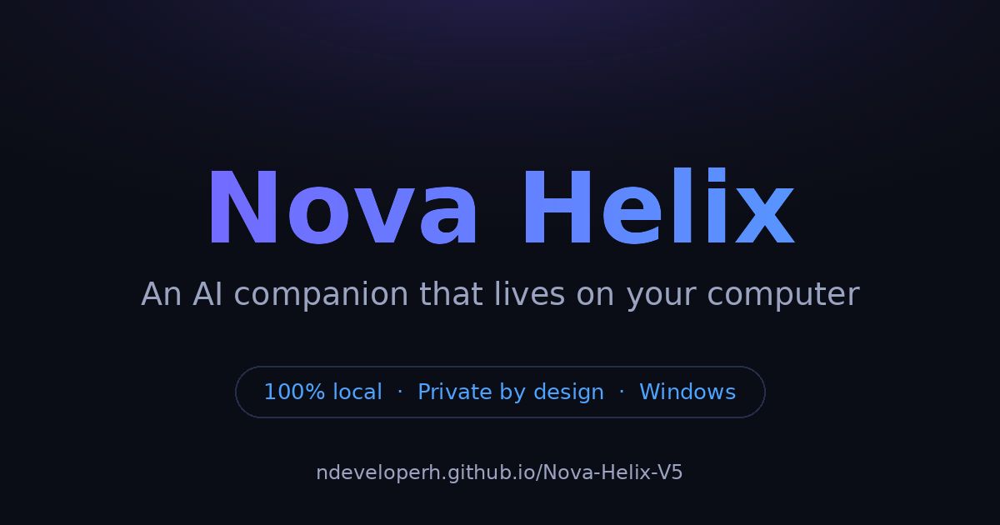

  

<h1 align="center">Nova Helix</h1>

  <strong>An AI companion that lives on <em>your</em> computer — not in someone else's cloud.</strong>

  <a href="https://ndeveloperh.github.io/Nova-Helix-V5/"><strong>🌐 Visit the showcase →</strong></a>

---

Nova Helix is a desktop AI assistant for Windows, powered by language models running
**entirely on your own hardware**. No account required to chat. No server round-trips.
No usage surveillance. What you tell Nova Helix stays on your machine.

## What makes it different

- **100% local** — the models, your conversations, and your memories all live on your PC.
  Unplug the internet and Nova Helix keeps working.
- **It remembers you** — persistent memory across sessions, with semantic recall: it finds
  what matters by *meaning*, not just keywords. Erase it any time; erased means erased.
- **A companion, not a chatbox** — a warm, focused colleague with real personality, live
  status that shows exactly what it's doing (reading, recalling, thinking, drafting), and
  a desktop presence you can theme to your taste.
- **Honest by design** — it tells you what it doesn't know instead of making things up,
  and cites its sources when it searches.
- **Built for real hardware** — the Free tier runs on standard laptops. Higher tiers scale
  up to flagship-class local models for high-end GPUs.

## Tiers

| | Free | Pro | Ultra |
|---|---|---|---|
| Price | **$0** | **$20/mo** | **$33/mo** |
| Local chat companion | ✔ | ✔ | ✔ |
| Persistent memory + semantic recall | ✔ | ✔ | ✔ |
| Runs on standard laptops | ✔ | ✔ | ✔ |
| Stronger everyday models | | ✔ | ✔ |
| Expanded theme library | | ✔ | ✔ |
| Flagship-class local models | | | ✔ |
| Heavy coding & large projects | | | ✔ |
| Voice & live desktop experiences | | | ✔ |

Every tier runs locally. Paid tiers unlock larger models and richer experiences —
not access to a server.

## Under the hood (the short version)

- A custom high-performance inference engine written in **Rust + CUDA**, with a
  CPU path tuned so the Free tier genuinely runs on ordinary laptops.
- A native desktop app built with **Flutter**.
- Offline licence verification — your licence works without phoning home.
- Signed updates.

## About this repository

This repository is the public showcase for Nova Helix. The product itself is
commercial software; the source is not published here.

| Path | What it is |
|---|---|
| `index.html` | The showcase site, published at [ndeveloperh.github.io/Nova-Helix-V5](https://ndeveloperh.github.io/Nova-Helix-V5/) via GitHub Pages |
| `og.png` | Social preview card used for link previews |
| `favicon.svg` | Site icon |
| `robots.txt`, `sitemap.xml` | Search engine hints |
| `tools/make-og-image.py` | Regenerates `og.png` (`pip install pillow && python3 tools/make-og-image.py`) |

The site is a single static HTML file with no build step — edit `index.html`,
push to `main`, and GitHub Pages redeploys it.

## Contact

Reach the developer via [GitHub](https://github.com/NdeveloperH) — or
[open an issue](https://github.com/NdeveloperH/Nova-Helix-V5/issues) on this repository.

## Licence

Copyright © 2026 NdeveloperH. All rights reserved. See [LICENSE](LICENSE).
